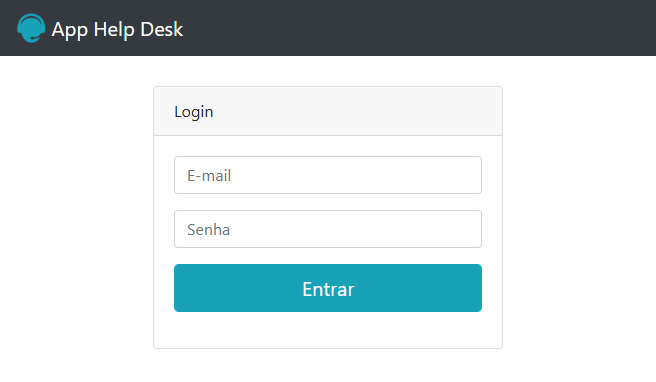
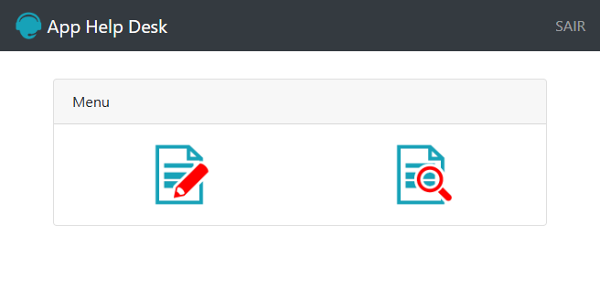
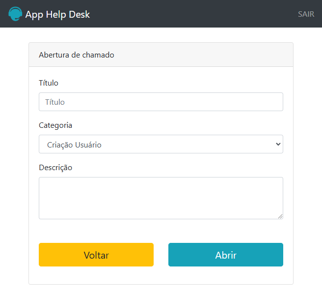
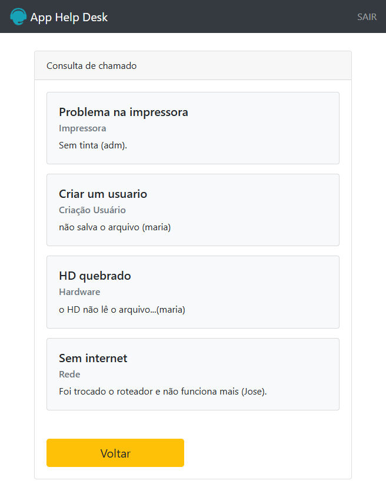

# HelpDesk

Curso online:

Domine Web - 20 Cursos - HTML5, CSS3, SASS, Bootstrap, JS, ES6, PHP, MySQL, JQuery, MVC, APIs, IONIC e muito mais

Autores:
Jorge Sant Ana e Jamilton Damasceno

Construção de um site Help Desk utilizando HTML5, CSS, Bootstrap 4 e PHP. 

>Figura 1: Login

 
>Figura 2: Home

>Figura 3: Cadastro de chamados

 >Figura 4: Consulta de chamados

 
 
 

